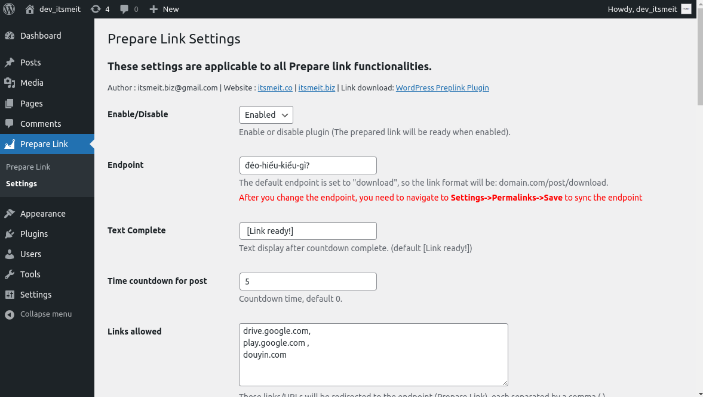

# Prepare Link Wordpress Plugin
## Redirect external links to the page you specify. This feature is useful for websites that display ads, such as Adsense or Ezoic...
##### Example: https://drive.google.com/file/xxxx to https://itsmeit.co/post/download?id=abc
------------------------------------------------
##### Document: https://itsmeit.co/tao-trang-chuyen-huong-link-download-wordpress.html
##### Author  : itsmeit '<itsmeit.biz@gmail.com>'
##### Website : https://itsmeit.co
---------------------------------------------------

### ==== How to use Prepare Link Wordpress Plugin ===
##### Step1. Upload and install then activate the plugin
##### Step2. Navigate to Admin: Prepare Link->Settings->Save
##### Step3. Navigate to Admin: Settings->Permalinks->Save

#### Note: You need to update the permalinks (Settings->Permalinks->Save) every time you change the prepare link config